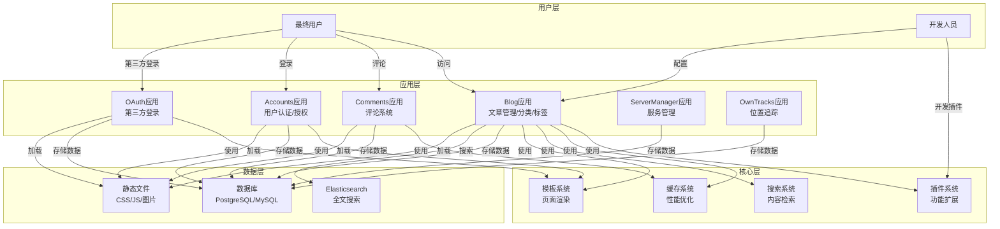

# DjangoBlog 用户使用手册

## 1. 项目概述

DjangoBlog 是一个基于 Django 框架开发的博客系统，具有以下特点：

- 完整的文章管理功能（发布、编辑、分类、标签）
- 评论系统支持
- 用户认证与授权
- 第三方 OAuth 登录
- 搜索功能（支持 Elasticsearch）
- 插件系统，支持功能扩展
- 多语言支持
- 响应式设计，适配不同设备

## 2. 系统架构

### 2.1 架构图



### 2.2 核心模块说明

| 模块 | 主要职责 | 文件位置 |
|------|---------|--------|
| Blog | 文章管理、分类、标签、首页展示 | blog/ |
| Accounts | 用户认证、授权、个人中心 | accounts/ |
| Comments | 评论管理、回复功能 | comments/ |
| OAuth | 第三方登录集成 | oauth/ |
| PluginSystem | 插件管理、功能扩展 | djangoblog/plugin_manage/ |
| CacheSystem | 缓存管理、性能优化 | djangoblog/utils.py |
| SearchSystem | 全文搜索、内容检索 | blog/search_indexes.py |

## 3. 开发人员指南

### 3.1 项目结构

```
DjangoBlog/
├── accounts/          # 用户认证相关
├── blog/              # 核心博客功能
├── comments/          # 评论系统
├── deploy/            # 部署配置
├── djangoblog/        # 项目核心配置
├── docs/              # 文档
├── locale/            # 多语言支持
├── oauth/             # 第三方登录
├── owntracks/         # 位置追踪
├── plugins/           # 插件目录
├── servermanager/     # 服务管理
├── templates/         # 模板文件
├── manage.py          # 管理脚本
└── requirements.txt   # 依赖文件
```

### 3.2 核心数据模型

#### 3.2.1 文章模型 (Article)

**功能**：存储博客文章内容、状态和相关信息

**主要字段**：
- title: 文章标题
- body: 文章内容（支持 Markdown）
- status: 状态（草稿/发布）
- comment_status: 评论状态（开放/关闭）
- type: 类型（文章/页面）
- views: 浏览次数
- author: 作者
- category: 分类
- tags: 标签（多对多）

**使用示例**：
```python
from blog.models import Article

# 创建文章
article = Article.objects.create(
    title="Hello World",
    body="# Hello World\n\nThis is my first article",
    status="p",  # 发布状态
    author=request.user,
    category=category
)
article.tags.add(tag1, tag2)

# 获取文章列表
articles = Article.objects.filter(status='p').order_by('-pub_time')

# 获取文章详情
article = Article.objects.get(id=1)
article.viewed()  # 增加浏览次数
```

#### 3.2.2 分类模型 (Category)

**功能**：文章分类管理，支持层级结构

**主要字段**：
- name: 分类名称
- parent_category: 父分类
- slug: 别名
- index: 排序索引

**使用示例**：
```python
from blog.models import Category

# 创建分类
category = Category.objects.create(
    name="技术",
    index=1
)

# 获取分类树
category_tree = category.get_category_tree()
```

#### 3.2.3 标签模型 (Tag)

**功能**：文章标签管理

**主要字段**：
- name: 标签名称
- slug: 别名

**使用示例**：
```python
from blog.models import Tag

# 创建标签
tag = Tag.objects.create(name="Python")

# 获取标签文章数
count = tag.get_article_count()
```

#### 3.2.4 评论模型 (Comment)

**功能**：文章评论管理，支持嵌套回复

**主要字段**：
- body: 评论内容
- author: 评论作者
- article: 所属文章
- parent_comment: 父评论（支持嵌套）
- is_enable: 是否启用

**使用示例**：
```python
from comments.models import Comment

# 创建评论
comment = Comment.objects.create(
    body="Great article!",
    author=request.user,
    article=article
)

# 创建回复
reply = Comment.objects.create(
    body="Thank you!",
    author=request.user,
    article=article,
    parent_comment=comment
)
```

### 3.3 插件系统

DjangoBlog 提供了灵活的插件系统，允许开发人员扩展系统功能。

#### 3.3.1 创建插件

1. 在 `plugins` 目录下创建插件目录，例如 `my_plugin`
2. 创建 `plugin.py` 文件，继承 `BasePlugin` 类
3. 实现插件功能

**示例插件**：
```python
from djangoblog.plugin_manage.base_plugin import BasePlugin

class MyPlugin(BasePlugin):
    PLUGIN_NAME = "My Plugin"
    PLUGIN_DESCRIPTION = "A demo plugin"
    PLUGIN_VERSION = "1.0.0"
    PLUGIN_AUTHOR = "Developer"
    
    SUPPORTED_POSITIONS = ['sidebar', 'article_bottom']
    
    def render_sidebar_widget(self, context, **kwargs):
        return self.render_template('sidebar_widget.html', context)
    
    def render_article_bottom_widget(self, context, **kwargs):
        return self.render_template('article_bottom_widget.html', context)
```

#### 3.3.2 插件钩子

插件可以通过钩子系统与系统其他部分交互：

- `ARTICLE_DETAIL_LOAD`: 文章详情加载时触发
- `after_article_body_get`: 文章内容获取后触发
- 更多钩子请查看 `djangoblog/plugin_manage/hook_constants.py`

### 3.4 缓存系统

DjangoBlog 使用缓存系统提高性能，主要缓存点包括：

- 文章列表
- 分类树
- 评论列表
- 热门文章
- 侧边栏内容

**缓存使用示例**：
```python
from djangoblog.utils import cache_decorator, cache

@cache_decorator(60 * 60 * 10)  # 缓存10小时
def get_hot_articles():
    return Article.objects.filter(status='p').order_by('-views')[:10]

# 手动操作缓存
cache_key = 'article_{id}'.format(id=1)
cache.set(cache_key, article, 60 * 10)  # 缓存10分钟
article = cache.get(cache_key)
```

### 3.5 搜索系统

DjangoBlog 支持基于 Haystack 的搜索功能，可配置使用 Elasticsearch 作为后端。

**配置示例**：
```python
# settings.py
HAYSTACK_CONNECTIONS = {
    'default': {
        'ENGINE': 'djangoblog.elasticsearch_backend.ElasticsearchSearchEngine',
        'URL': 'http://localhost:9200/',
        'INDEX_NAME': 'djangoblog',
    },
}
```

### 3.6 多语言支持

DjangoBlog 支持多语言，默认包含中文和英文：

- 语言文件位置：`locale/`
- 切换语言：通过 URL 前缀，如 `/en/` 或 `/zh-hans/`

## 4. 最终用户指南

### 4.1 浏览文章

1. **首页**：展示最新发布的文章列表
2. **分类页**：按分类浏览文章
3. **标签页**：按标签浏览文章
4. **归档页**：按时间归档浏览文章
5. **作者页**：查看特定作者的文章

### 4.2 文章详情

1. **阅读文章**：查看文章完整内容
2. **评论文章**：在文章下方发表评论
3. **分享文章**：通过社交平台分享文章
4. **查看相关文章**：文章底部显示相关推荐

### 4.3 用户功能

#### 4.3.1 注册与登录

1. **注册**：填写用户名、邮箱、密码完成注册
2. **登录**：使用用户名/邮箱和密码登录
3. **忘记密码**：通过邮箱重置密码
4. **第三方登录**：支持 GitHub、Google 等第三方平台登录

#### 4.3.2 个人中心

1. **修改个人信息**：更新头像、昵称等
2. **查看我的评论**：管理自己发表的评论
3. **查看我的文章**：管理自己发布的文章（如果有权限）

### 4.4 评论系统

1. **发表评论**：在文章下方填写评论内容
2. **回复评论**：对已有评论进行回复
3. **评论审核**：根据系统设置，评论可能需要审核后显示

### 4.5 搜索功能

1. **全局搜索**：在顶部搜索框输入关键词
2. **搜索结果**：查看搜索结果列表，支持分页
3. **搜索建议**：根据输入提供搜索建议

## 5. 配置与部署

### 5.1 本地开发

1. **安装依赖**：
   ```bash
   pip install -r requirements.txt
   ```

2. **配置数据库**：
   修改 `djangoblog/settings.py` 中的数据库配置

3. **初始化数据库**：
   ```bash
   python manage.py migrate
   ```

4. **创建超级用户**：
   ```bash
   python manage.py createsuperuser
   ```

5. **启动开发服务器**：
   ```bash
   python manage.py runserver
   ```

### 5.2 生产部署

#### 5.2.1 Docker 部署

1. **构建镜像**：
   ```bash
   docker build -t djangoblog .
   ```

2. **运行容器**：
   ```bash
   docker run -d -p 8000:8000 djangoblog
   ```

#### 5.2.2 Kubernetes 部署

参考 `deploy/k8s/` 目录下的配置文件，使用 kubectl 部署。

### 5.3 系统配置

1. **基本配置**：登录后台管理界面，在 "Website configuration" 中设置
   - 站点名称
   - 站点描述
   - SEO 配置
   - 评论设置
   - 广告设置

2. **邮件配置**：在 `settings.py` 中配置邮件服务器
   ```python
   EMAIL_BACKEND = 'django.core.mail.backends.smtp.EmailBackend'
   EMAIL_HOST = 'smtp.example.com'
   EMAIL_PORT = 587
   EMAIL_HOST_USER = 'your-email@example.com'
   EMAIL_HOST_PASSWORD = 'your-password'
   EMAIL_USE_TLS = True
   DEFAULT_FROM_EMAIL = 'your-email@example.com'
   ```

3. **OAuth 配置**：在后台管理界面配置第三方登录
   - GitHub
   - Google
   - 其他支持的平台

## 6. 功能扩展与定制

### 6.1 添加新功能

1. **创建新插件**：按照 3.3 节的说明创建插件
2. **修改现有代码**：
   - 文章模型：`blog/models.py`
   - 视图逻辑：`blog/views.py`
   - 模板文件：`templates/blog/`

### 6.2 定制主题

1. **修改 CSS**：编辑 `blog/static/blog/css/style.css`
2. **修改模板**：编辑 `templates/blog/` 下的模板文件
3. **添加新模板**：在 `templates/blog/` 目录下创建新模板

### 6.3 性能优化

1. **启用缓存**：配置 Redis 或 Memcached 作为缓存后端
2. **使用 CDN**：为静态文件配置 CDN
3. **数据库优化**：
   - 创建适当的索引
   - 使用数据库连接池
   - 优化查询语句

## 7. 常见问题与解决方案

### 7.1 文章无法发布

**可能原因**：
- 文章状态设置为草稿
- 分类未选择
- 内容为空

**解决方案**：
- 确认文章状态为 "Published"
- 选择合适的分类
- 填写文章内容

### 7.2 评论不显示

**可能原因**：
- 评论需要审核
- 评论状态被设为禁用
- 文章评论功能被关闭

**解决方案**：
- 登录后台审核评论
- 检查评论状态
- 确认文章评论设置为 "Open"

### 7.3 搜索功能不工作

**可能原因**：
- 搜索索引未构建
- Elasticsearch 未运行
- 搜索配置错误

**解决方案**：
- 运行 `python manage.py build_index` 构建索引
- 确认 Elasticsearch 服务正常运行
- 检查搜索配置

### 7.4 插件不生效

**可能原因**：
- 插件未正确安装
- 插件依赖未满足
- 插件配置错误

**解决方案**：
- 确认插件目录结构正确
- 安装插件所需依赖
- 检查插件配置

## 8. 总结

DjangoBlog 是一个功能完整、架构清晰的博客系统，适合个人或小团队使用。通过本手册，开发人员可以了解系统架构和扩展点，方便进行功能定制和扩展；最终用户可以快速上手使用系统的各项功能，享受流畅的博客体验。

系统的插件架构设计使得功能扩展变得简单，开发人员可以根据需求开发自定义插件，不断丰富系统功能。同时，系统的缓存机制和搜索优化也保证了良好的性能表现。

希望本手册能够帮助您更好地理解和使用 DjangoBlog 系统！