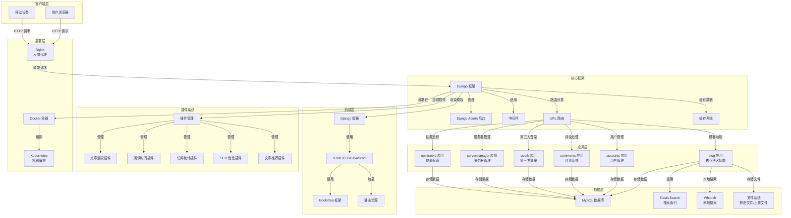

# DjangoBlog 系统架构图

## 架构说明

1. **客户端层**：支持浏览器和移动设备访问

2. **前端层**：
   - 使用 HTML/CSS/JavaScript 构建用户界面
   - 集成 Bootstrap 框架实现响应式设计
   - Django 模板系统实现服务端渲染

3. **应用层**：
   - **blog**：核心博客功能，包括文章、分类、标签管理
   - **accounts**：用户管理，包括注册、登录、个人资料
   - **comments**：评论系统，支持文章评论
   - **oauth**：第三方登录集成
   - **servermanager**：服务器管理功能
   - **owntracks**：位置追踪功能

4. **核心框架**：
   - Django 框架提供 MVC 架构支持
   - 自定义 Admin 后台
   - 中间件处理请求/响应
   - 缓存系统提升性能

5. **数据层**：
   - MySQL 数据库存储核心数据
   - ElasticSearch/Whoosh 提供搜索功能
   - 文件系统存储静态资源和上传文件

6. **插件系统**：
   - 可扩展的插件架构
   - 内置多个功能插件

7. **部署层**：
   - 支持 Docker 容器化部署
   - Kubernetes 容器编排
   - Nginx 反向代理