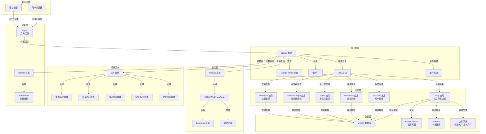

# DjangoBlog 完整用户使用手册

## 文档说明

本手册是 DjangoBlog 博客系统的完整使用指南，包含两部分内容：

1. **开发人员参考**：面向开发人员，提供系统架构、扩展开发、部署配置等技术信息
2. **最终用户指南**：面向普通用户，提供注册登录、浏览文章、评论互动等操作指南

通过本手册，开发人员可以了解系统架构并进行功能扩展，最终用户可以快速上手使用博客功能。

## 第一部分：开发人员参考

### 1. 项目概述

DjangoBlog 是一个基于 Django 框架开发的博客系统，具有完整的文章管理、评论系统、用户管理、搜索功能和插件架构。

#### 1.1 核心功能

- 文章管理（发布、编辑、删除）
- 分类和标签系统
- 评论系统
- 用户管理和认证
- 第三方登录集成
- 搜索功能（支持 Whoosh 和 ElasticSearch）
- 插件系统
- 响应式前端设计
- 多语言支持

#### 1.2 技术栈

- **后端**：Django 4.0+
- **数据库**：MySQL
- **搜索引擎**：Whoosh（默认）/ ElasticSearch
- **前端**：Bootstrap 4
- **缓存**：Django 缓存系统（支持 Redis）
- **部署**：Docker / Kubernetes

### 2. 项目结构

```
DjangoBlog/
├── accounts/          # 用户管理应用
├── blog/              # 核心博客应用
├── comments/          # 评论系统应用
├── deploy/            # 部署配置文件
├── djangoblog/        # 项目配置和核心功能
├── docs/              # 文档
├── locale/            # 多语言文件
├── oauth/             # 第三方登录应用
├── owntracks/         # 位置追踪应用
├── plugins/           # 插件目录
├── servermanager/     # 服务器管理应用
├── templates/         # 模板文件
├── manage.py          # Django 管理命令
└── requirements.txt   # 依赖包
```

### 3. 系统架构

#### 3.1 架构图



### 4. 插件系统开发

#### 4.1 插件结构

```
plugins/
└── plugin_name/
    ├── __init__.py
    ├── plugin.py        # 插件核心文件
    └── static/          # 静态资源
        └── plugin_name/
            ├── css/
            └── js/
```

#### 4.2 插件开发示例

```python
from djangoblog.plugin_manage.base_plugin import BasePlugin

class MyPlugin(BasePlugin):
    # 插件元数据
    PLUGIN_NAME = "我的插件"
    PLUGIN_DESCRIPTION = "这是一个示例插件"
    PLUGIN_VERSION = "1.0.0"
    PLUGIN_AUTHOR = "开发者"

    # 支持的显示位置
    SUPPORTED_POSITIONS = ['sidebar', 'article_bottom']

    # 各位置的优先级
    POSITION_PRIORITIES = {
        'sidebar': 50,
        'article_bottom': 80
    }

    def init_plugin(self):
        """插件初始化"""
        super().init_plugin()
        # 自定义初始化逻辑

    def render_sidebar_widget(self, context, **kwargs):
        """渲染侧边栏组件"""
        return self.render_template('sidebar_widget.html', context)

    def render_article_bottom_widget(self, context, **kwargs):
        """渲染文章底部组件"""
        return self.render_template('article_bottom_widget.html', context)

# 导出插件实例
plugin = MyPlugin()
```

### 5. 核心数据模型

#### 5.1 文章模型 (Article)

| 字段名 | 类型 | 描述 |
|-------|------|------|
| title | CharField | 文章标题 |
| body | MDTextField | 文章内容（Markdown 格式） |
| status | CharField | 状态（草稿/已发布） |
| comment_status | CharField | 评论状态（开放/关闭） |
| type | CharField | 类型（文章/页面） |
| views | PositiveIntegerField | 浏览次数 |
| author | ForeignKey | 作者 |
| category | ForeignKey | 分类 |
| tags | ManyToManyField | 标签 |

### 6. API 接口

#### 6.1 博客 API

```python
from servermanager.api.blogapi import BlogApi

# 搜索文章
api = BlogApi()
results = api.search_articles('关键词')

# 获取分类列表
categories = api.get_category_lists()

# 获取分类文章
articles = api.get_category_articles('分类名')

# 获取最新文章
recent_articles = api.get_recent_articles()
```

### 7. 部署配置

#### 7.1 Docker 部署

```bash
docker build -t djangoblog .

docker run -d -p 8000:8000 --name djangoblog \
    -e DJANGO_DEBUG=False \
    -e DJANGO_MYSQL_HOST=mysql \
    djangoblog
```

#### 7.2 Kubernetes 部署

```bash
kubectl apply -f deploy/k8s/
```

### 8. 常用开发命令

```bash
# 运行开发服务器
python manage.py runserver

# 生成迁移文件
python manage.py makemigrations

# 执行迁移
python manage.py migrate

# 创建超级用户
python manage.py createsuperuser

# 收集静态文件
python manage.py collectstatic

# 构建搜索索引
python manage.py build_index

# 清除缓存
python manage.py clear_cache
```

## 第二部分：最终用户指南

### 1. 系统介绍

欢迎使用 DjangoBlog 博客系统！这是一个功能强大、界面友好的博客平台，您可以在这里阅读文章、发表评论、与其他用户交流。

#### 1.1 主要功能

- **文章浏览**：阅读各类文章，支持分类和标签筛选
- **评论互动**：对文章发表评论，参与讨论
- **搜索功能**：快速查找感兴趣的内容
- **用户中心**：管理个人资料和评论
- **第三方登录**：支持多种第三方账号登录
- **响应式设计**：适配电脑、平板和手机等多种设备

### 2. 注册与登录

#### 2.1 注册账号

1. 点击网站右上角的「注册」按钮
2. 填写注册信息：用户名、邮箱、密码
3. 点击「注册」按钮完成注册
4. 注册成功后，系统会自动登录并跳转到首页

#### 2.2 登录账号

1. 点击网站右上角的「登录」按钮
2. 输入登录信息：用户名或邮箱、密码
3. 点击「登录」按钮
4. 登录成功后，系统会跳转到首页

#### 2.3 第三方登录

1. 在登录页面，点击第三方登录图标（如 GitHub、Google 等）
2. 按照提示完成第三方平台的授权
3. 首次使用第三方登录时，需要绑定邮箱
4. 绑定成功后，系统会自动登录

### 3. 文章浏览

#### 3.1 首页文章

- 网站首页会展示最新发布的文章
- 每页显示 10 篇文章（可在后台设置）
- 点击文章标题或「阅读更多」进入文章详情页

#### 3.2 文章详情页

文章详情页包含以下内容：
- 文章标题
- 发布时间
- 作者信息
- 文章内容（支持图片、代码等）
- 文章标签
- 上一篇/下一篇文章导航
- 评论区

#### 3.3 分类浏览

1. 在网站侧边栏或导航栏找到「分类」
2. 点击分类名称进入该分类的文章列表
3. 浏览该分类下的所有文章

#### 3.4 标签浏览

1. 在网站侧边栏找到「热门标签」
2. 点击标签名称进入该标签的文章列表
3. 浏览包含该标签的所有文章

#### 3.5 文章归档

1. 在网站导航栏找到「归档」
2. 进入归档页面，按照年份和月份查看文章
3. 点击文章标题进入详情页

### 4. 评论功能

#### 4.1 发表评论

1. 登录账号（未登录用户无法发表评论）
2. 进入文章详情页，滚动到页面底部的评论区
3. 在评论输入框中输入评论内容
4. 点击「发表评论」按钮
5. 评论成功后，会显示在评论区

#### 4.2 回复评论

1. 登录账号
2. 在评论区找到要回复的评论
3. 点击评论下方的「回复」按钮
4. 在弹出的输入框中输入回复内容
5. 点击「回复」按钮
6. 回复会显示在对应评论下方

### 5. 搜索功能

#### 5.1 基本搜索

1. 在网站顶部的搜索框中输入关键词
2. 按下回车键或点击搜索图标
3. 系统会显示包含关键词的文章列表
4. 点击文章标题进入详情页

### 6. 个人中心

#### 6.1 个人资料管理

1. 登录账号后，点击右上角的用户名
2. 选择「个人中心」
3. 在个人资料页面，可以修改：昵称、头像、个人简介、密码
4. 点击「保存」按钮完成修改

#### 6.2 我的评论

1. 进入个人中心
2. 找到「我的评论」选项
3. 查看所有已发表的评论
4. 可以删除自己的评论

### 7. 多语言支持

#### 7.1 切换语言

1. 在网站顶部找到语言切换按钮
2. 选择您需要的语言（如中文、英文等）
3. 网站会自动切换到所选语言

### 8. 常见问题

#### 8.1 账号相关

**Q: 忘记密码怎么办？**
A: 在登录页面点击「忘记密码」，按照提示通过邮箱重置密码。

**Q: 可以修改用户名吗？**
A: 目前系统暂不支持修改用户名，建议注册时选择合适的用户名。

#### 8.2 评论相关

**Q: 为什么我的评论没有显示？**
A: 可能是因为评论需要管理员审核，审核通过后会显示。

**Q: 可以编辑已发表的评论吗？**
A: 目前系统暂不支持编辑评论，您可以删除后重新发表。

### 9. 使用技巧

#### 9.1 快速导航

- 使用网站顶部的导航栏快速访问主要功能
- 使用侧边栏的分类和标签快速筛选内容
- 使用浏览器的书签功能保存常用页面

#### 9.2 阅读体验

- 文章支持目录导航（如果作者开启）
- 可以调整浏览器字体大小改善阅读体验
- 支持夜间模式（如果浏览器支持）

## 附录

### 1. 系统配置项

| 配置项 | 描述 | 默认值 |
|-------|------|--------|
| DJANGO_DEBUG | 是否开启调试模式 | True |
| DJANGO_MYSQL_HOST | MySQL 主机 | 127.0.0.1 |
| DJANGO_MYSQL_PORT | MySQL 端口 | 3306 |
| DJANGO_ELASTICSEARCH_HOST | ElasticSearch 主机 | - |
| DJANGO_REDIS_URL | Redis 主机:端口 | - |

### 2. 插件列表

| 插件名称 | 功能描述 |
|---------|---------|
| article_copyright | 文章版权信息 |
| reading_time | 阅读时间估算 |
| view_count | 文章浏览统计 |
| seo_optimizer | SEO 优化 |
| article_recommendation | 文章推荐 |
| image_lazy_loading | 图片懒加载 |
| external_links | 外部链接处理 |

### 3. 故障排查

| 问题 | 可能原因 | 解决方案 |
|------|---------|----------|
| 插件加载失败 | 插件代码错误 | 检查插件代码，查看日志 |
| 搜索功能不工作 | 索引未构建 | 运行 `python manage.py build_index` |
| 页面加载缓慢 | 缓存未配置 | 配置 Redis 缓存 |
| 数据库连接失败 | 数据库配置错误 | 检查数据库配置和连接 |

### 4. 扩展功能建议

1. **主题系统**：开发多主题支持
2. **API 扩展**：实现完整的 RESTful API
3. **社交媒体集成**：添加社交媒体分享和登录
4. **内容管理**：增强文章管理功能
5. **数据分析**：添加网站访问统计和分析
6. **多站点支持**：实现多博客站点管理

---

**版本**：1.0.0  
**更新日期**：2026-01-21  
**维护者**：DjangoBlog 开发团队