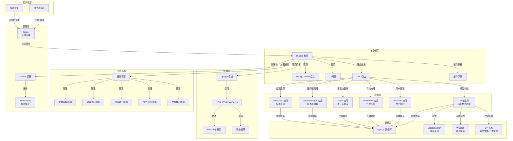

# DjangoBlog 开发人员参考手册

## 1. 项目概述

DjangoBlog 是一个基于 Django 框架开发的博客系统，具有完整的文章管理、评论系统、用户管理、搜索功能和插件架构。本手册旨在帮助开发人员快速了解项目结构，进行功能扩展和定制开发。

### 1.1 核心功能

- 文章管理（发布、编辑、删除）
- 分类和标签系统
- 评论系统
- 用户管理和认证
- 第三方登录集成
- 搜索功能（支持 Whoosh 和 ElasticSearch）
- 插件系统
- 响应式前端设计
- 多语言支持

### 1.2 技术栈

- **后端**：Django 4.0+
- **数据库**：MySQL
- **搜索引擎**：Whoosh（默认）/ ElasticSearch
- **前端**：Bootstrap 4
- **缓存**：Django 缓存系统（支持 Redis）
- **部署**：Docker / Kubernetes

## 2. 项目结构

```
DjangoBlog/
├── accounts/          # 用户管理应用
├── blog/              # 核心博客应用
├── comments/          # 评论系统应用
├── deploy/            # 部署配置文件
├── djangoblog/        # 项目配置和核心功能
├── docs/              # 文档
├── locale/            # 多语言文件
├── oauth/             # 第三方登录应用
├── owntracks/         # 位置追踪应用
├── plugins/           # 插件目录
├── servermanager/     # 服务器管理应用
├── templates/         # 模板文件
├── manage.py          # Django 管理命令
└── requirements.txt   # 依赖包
```

### 2.1 核心应用说明

| 应用名称 | 主要功能 | 位置 |
|---------|---------|------|
| blog | 核心博客功能，包括文章、分类、标签管理 | blog/ |
| accounts | 用户管理，包括注册、登录、个人资料 | accounts/ |
| comments | 评论系统，支持文章评论 | comments/ |
| oauth | 第三方登录集成 | oauth/ |
| servermanager | 服务器管理功能 | servermanager/ |
| owntracks | 位置追踪功能 | owntracks/ |

## 3. 系统架构

### 3.1 架构图



### 3.2 数据流

1. **用户请求**：用户通过浏览器访问网站
2. **路由分发**：Django 根据 URL 路由将请求分发到对应应用
3. **业务处理**：各应用处理业务逻辑
4. **数据操作**：与数据库、缓存、搜索引擎等交互
5. **模板渲染**：使用 Django 模板系统渲染页面
6. **响应返回**：将渲染后的页面返回给用户

## 4. 插件系统开发

DjangoBlog 具有强大的插件系统，允许开发人员通过插件扩展功能而无需修改核心代码。

### 4.1 插件结构

```
plugins/
└── plugin_name/
    ├── __init__.py
    ├── plugin.py        # 插件核心文件
    └── static/          # 静态资源
        └── plugin_name/
            ├── css/
            └── js/
```

### 4.2 插件开发步骤

#### 4.2.1 创建插件目录结构

1. 在 `plugins/` 目录下创建插件文件夹（如 `my_plugin`）
2. 创建 `plugin.py` 文件，实现插件核心逻辑
3. 创建静态资源目录（如需）

#### 4.2.2 编写插件代码

```python
from djangoblog.plugin_manage.base_plugin import BasePlugin

class MyPlugin(BasePlugin):
    # 插件元数据
    PLUGIN_NAME = "我的插件"
    PLUGIN_DESCRIPTION = "这是一个示例插件"
    PLUGIN_VERSION = "1.0.0"
    PLUGIN_AUTHOR = "开发者"

    # 支持的显示位置
    SUPPORTED_POSITIONS = ['sidebar', 'article_bottom']

    # 各位置的优先级
    POSITION_PRIORITIES = {
        'sidebar': 50,
        'article_bottom': 80
    }

    def init_plugin(self):
        """插件初始化"""
        super().init_plugin()
        # 自定义初始化逻辑

    def render_sidebar_widget(self, context, **kwargs):
        """渲染侧边栏组件"""
        return self.render_template('sidebar_widget.html', context)

    def render_article_bottom_widget(self, context, **kwargs):
        """渲染文章底部组件"""
        return self.render_template('article_bottom_widget.html', context)

# 导出插件实例
plugin = MyPlugin()
```

#### 4.2.3 注册插件

在 `djangoblog/settings.py` 中的 `ACTIVE_PLUGINS` 列表中添加插件名称：

```python
ACTIVE_PLUGINS = [
    'article_copyright',
    'reading_time',
    'my_plugin',  # 添加你的插件
]
```

### 4.3 插件钩子

插件系统提供了多种钩子，允许插件在特定事件触发时执行操作：

- `ARTICLE_DETAIL_LOAD`：文章详情加载时
- `after_article_body_get`：文章内容获取后
- 自定义钩子：可通过 `hooks.register_hook()` 注册

## 5. 核心数据模型

### 5.1 文章模型 (Article)

| 字段名 | 类型 | 描述 |
|-------|------|------|
| title | CharField | 文章标题 |
| body | MDTextField | 文章内容（Markdown 格式） |
| status | CharField | 状态（草稿/已发布） |
| comment_status | CharField | 评论状态（开放/关闭） |
| type | CharField | 类型（文章/页面） |
| views | PositiveIntegerField | 浏览次数 |
| author | ForeignKey | 作者 |
| category | ForeignKey | 分类 |
| tags | ManyToManyField | 标签 |

### 5.2 分类模型 (Category)

| 字段名 | 类型 | 描述 |
|-------|------|------|
| name | CharField | 分类名称 |
| parent_category | ForeignKey | 父分类 |
| slug | SlugField | 分类别名 |
| index | IntegerField | 排序索引 |

### 5.3 标签模型 (Tag)

| 字段名 | 类型 | 描述 |
|-------|------|------|
| name | CharField | 标签名称 |
| slug | SlugField | 标签别名 |

### 5.4 用户模型 (BlogUser)

| 字段名 | 类型 | 描述 |
|-------|------|------|
| username | CharField | 用户名 |
| email | EmailField | 邮箱 |
| password | CharField | 密码 |
| avatar | CharField | 头像 URL |
| nickname | CharField | 昵称 |

## 6. API 接口

### 6.1 内置 API

#### 6.1.1 博客 API

```python
from servermanager.api.blogapi import BlogApi

# 搜索文章
api = BlogApi()
results = api.search_articles('关键词')

# 获取分类列表
categories = api.get_category_lists()

# 获取分类文章
articles = api.get_category_articles('分类名')

# 获取最新文章
recent_articles = api.get_recent_articles()
```

#### 6.1.2 健康检查 API

- URL: `/health/`
- 方法: GET
- 描述: 返回服务健康状态

### 6.2 自定义 API 开发

在应用中创建 `api` 目录，实现 RESTful API：

```python
# servermanager/api/blogapi.py
class BlogApi:
    def search_articles(self, query):
        # 实现搜索逻辑
        pass
```

## 7. 模板系统

### 7.1 模板结构

```
templates/
├── blog/              # 博客相关模板
├── comments/          # 评论相关模板
├── account/           # 用户相关模板
├── oauth/             # 第三方登录模板
├── share_layout/      # 共享布局模板
└── plugins/           # 插件模板
```

### 7.2 模板继承

DjangoBlog 使用模板继承系统，基础模板为 `share_layout/base.html`：

```html


{{ article.title }}


    <!-- 内容区域 -->

```

### 7.3 模板标签

系统提供了多个自定义模板标签，方便在模板中使用：

- `blog_tags`：博客相关标签
- `comments_tags`：评论相关标签
- `oauth_tags`：第三方登录相关标签

## 8. 部署配置

### 8.1 Docker 部署

#### 8.1.1 构建镜像

```bash
docker build -t djangoblog .
```

#### 8.1.2 运行容器

```bash
docker run -d -p 8000:8000 --name djangoblog \
    -e DJANGO_DEBUG=False \
    -e DJANGO_MYSQL_HOST=mysql \
    djangoblog
```

#### 8.1.3 Docker Compose

使用 `deploy/docker-compose/docker-compose.yml`：

```bash
cd deploy/docker-compose
docker-compose up -d
```

### 8.2 Kubernetes 部署

使用 `deploy/k8s/` 目录下的配置文件：

```bash
kubectl apply -f deploy/k8s/
```

### 8.3 环境变量配置

| 环境变量 | 描述 | 默认值 |
|---------|------|--------|
| DJANGO_SECRET_KEY | Django 密钥 | 随机生成 |
| DJANGO_DEBUG | 是否开启调试模式 | True |
| DJANGO_MYSQL_HOST | MySQL 主机 | 127.0.0.1 |
| DJANGO_MYSQL_PORT | MySQL 端口 | 3306 |
| DJANGO_MYSQL_USER | MySQL 用户 | root |
| DJANGO_MYSQL_PASSWORD | MySQL 密码 | - |
| DJANGO_MYSQL_DATABASE | MySQL 数据库 | djangoblog |
| DJANGO_ELASTICSEARCH_HOST | ElasticSearch 主机 | - |
| DJANGO_REDIS_URL | Redis 主机:端口 | - |

## 9. 开发最佳实践

### 9.1 代码规范

- 遵循 PEP 8 代码规范
- 使用类型提示
- 编写清晰的文档字符串
- 保持代码简洁明了

### 9.2 性能优化

- 使用缓存减少数据库查询
- 合理使用 `select_related` 和 `prefetch_related`
- 优化模板渲染
- 使用异步任务处理耗时操作

### 9.3 安全注意事项

- 避免 SQL 注入
- 防止 XSS 攻击
- 保护敏感信息
- 正确处理用户输入
- 使用 HTTPS

## 10. 常用开发命令

### 10.1 Django 管理命令

```bash
# 运行开发服务器
python manage.py runserver

# 生成迁移文件
python manage.py makemigrations

# 执行迁移
python manage.py migrate

# 创建超级用户
python manage.py createsuperuser

# 收集静态文件
python manage.py collectstatic

# 构建搜索索引
python manage.py build_index

# 清除缓存
python manage.py clear_cache
```

### 10.2 插件开发命令

```bash
# 启动开发服务器（自动加载插件）
python manage.py runserver

# 检查插件状态
python manage.py shell
>>> from djangoblog.plugin_manage.loader import get_plugins_info
>>> get_plugins_info()
```

## 11. 故障排查

### 11.1 常见问题

| 问题 | 可能原因 | 解决方案 |
|------|---------|----------|
| 插件加载失败 | 插件代码错误 | 检查插件代码，查看日志 |
| 搜索功能不工作 | 索引未构建 | 运行 `python manage.py build_index` |
| 页面加载缓慢 | 缓存未配置 | 配置 Redis 缓存 |
| 数据库连接失败 | 数据库配置错误 | 检查数据库配置和连接 |

### 11.2 日志查看

系统日志位于 `logs/djangoblog.log`，可通过以下命令查看：

```bash
tail -f logs/djangoblog.log
```

## 12. 扩展功能建议

### 12.1 推荐扩展方向

1. **主题系统**：开发多主题支持
2. **API 扩展**：实现完整的 RESTful API
3. **社交媒体集成**：添加社交媒体分享和登录
4. **内容管理**：增强文章管理功能
5. **数据分析**：添加网站访问统计和分析
6. **多站点支持**：实现多博客站点管理

### 12.2 插件开发建议

- **SEO 优化插件**：自动生成 SEO 标签
- **图片处理插件**：图片压缩和水印
- **内容推荐插件**：基于用户行为推荐内容
- **订阅插件**：邮件订阅和推送
- **备份插件**：自动备份数据库和文件

## 13. 结语

DjangoBlog 是一个功能完整、架构清晰的博客系统，具有良好的扩展性和可维护性。通过本手册的指导，开发人员可以快速上手，进行功能扩展和定制开发。

如需更多帮助，请参考项目文档或提交 Issue 到 GitHub 仓库。

---

**版本**：1.0.0  
**更新日期**：2026-01-21  
**维护者**：DjangoBlog 开发团队