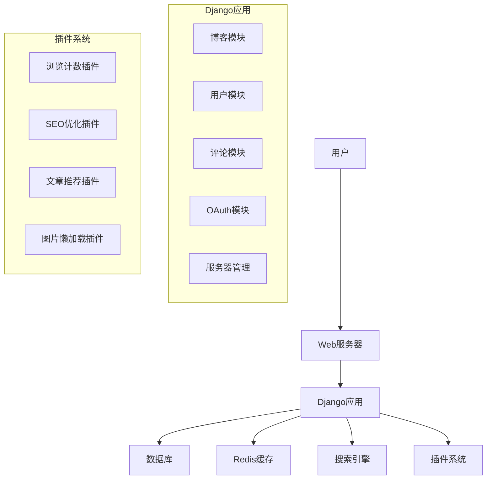
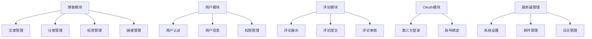
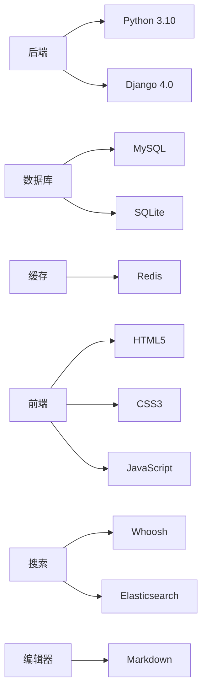
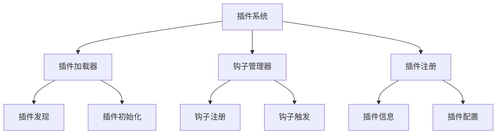
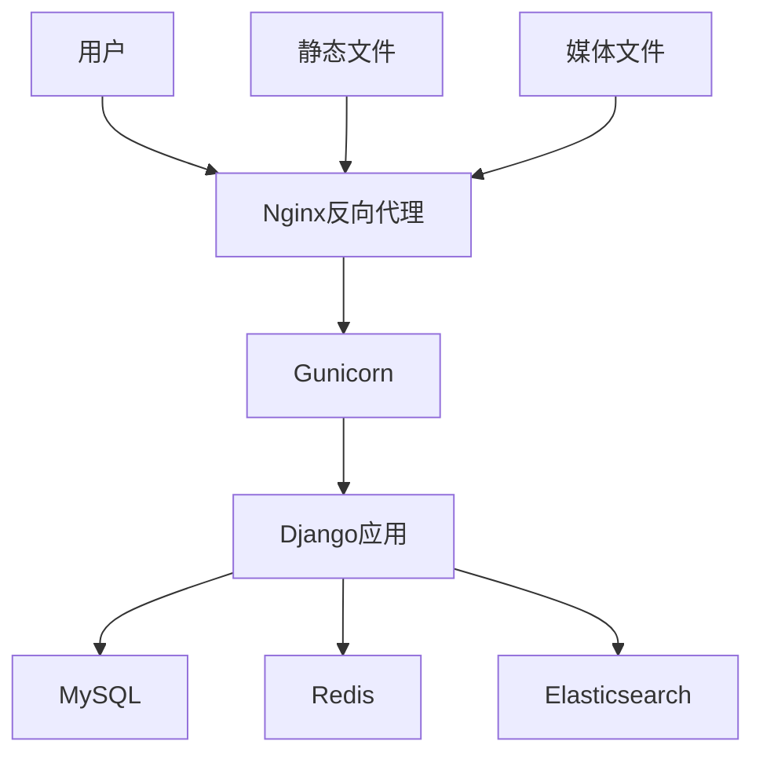

# DjangoBlog 用户使用手册

## 一、系统概述

DjangoBlog 是一款基于 Python 3.10 和 Django 4.0 构建的高性能博客平台。它不仅提供了传统博客的所有核心功能，还通过一个灵活的插件系统，让您可以轻松扩展和定制您的网站。无论您是个人博主、技术爱好者还是内容创作者，DjangoBlog 都旨在为您提供一个稳定、高效且易于维护的写作和发布环境。

### 1.1 主要特性

- **强大的内容管理**: 支持文章、独立页面、分类和标签的完整管理。内置强大的 Markdown 编辑器，支持代码语法高亮。
- **全文搜索**: 集成搜索引擎，提供快速、精准的文章内容搜索。
- **互动评论系统**: 支持回复、邮件提醒等功能，评论内容同样支持 Markdown。
- **灵活的侧边栏**: 可自定义展示最新文章、最多阅读、标签云等模块。
- **社交化登录**: 内置 OAuth 支持，已集成 Google, GitHub, Facebook, 微博, QQ 等主流平台。
- **高性能缓存**: 原生支持 Redis 缓存，并提供自动刷新机制，确保网站高速响应。
- **SEO 友好**: 具备基础 SEO 功能，新内容发布后可自动通知 Google 和百度。
- **便捷的插件系统**: 通过创建独立的插件来扩展博客功能，代码解耦，易于维护。我们已经通过插件实现了文章浏览计数、SEO 优化等功能！
- **集成图床**: 内置简单的图床功能，方便图片上传和管理。
- **自动化前端**: 集成 `django-compressor`，自动压缩和优化 CSS 及 JavaScript 文件。
- **健壮的运维**: 内置网站异常邮件提醒和微信公众号管理功能。

## 二、系统架构

### 2.1 整体架构



### 2.2 模块架构



### 2.3 技术栈



## 三、核心功能模块

### 3.1 博客模块

#### 3.1.1 文章管理

文章是博客的核心内容，DjangoBlog 提供了完整的文章管理功能：

- **文章创建**: 支持 Markdown 格式的文章编辑，支持代码语法高亮、图片插入等功能。
- **文章编辑**: 支持对已发布文章进行编辑和修改。
- **文章发布**: 支持草稿和发布两种状态，可随时切换。
- **文章分类**: 支持对文章进行分类管理，便于用户查找。
- **文章标签**: 支持为文章添加标签，便于用户搜索和关联。

#### 3.1.2 分类管理

分类是对文章进行组织的重要方式，DjangoBlog 支持多级分类：

- **分类创建**: 支持创建一级分类和子分类。
- **分类编辑**: 支持对分类名称、排序等信息进行编辑。
- **分类删除**: 支持删除分类，删除分类时会将该分类下的文章移动到默认分类。

#### 3.1.3 标签管理

标签是对文章进行标记的重要方式，DjangoBlog 支持标签管理：

- **标签创建**: 支持创建新的标签。
- **标签编辑**: 支持对标签名称进行编辑。
- **标签删除**: 支持删除标签，删除标签时会将该标签从所有文章中移除。

#### 3.1.4 链接管理

链接是博客中常用的功能，DjangoBlog 支持友情链接管理：

- **链接创建**: 支持创建新的友情链接。
- **链接编辑**: 支持对链接名称、URL、显示位置等信息进行编辑。
- **链接删除**: 支持删除友情链接。

### 3.2 用户模块

#### 3.2.1 用户认证

DjangoBlog 支持多种用户认证方式：

- **用户名密码登录**: 支持传统的用户名密码登录方式。
- **第三方登录**: 支持 Google、GitHub、Facebook、微博、QQ 等第三方平台登录。
- **邮箱验证**: 支持邮箱验证功能，确保用户邮箱的真实性。

#### 3.2.2 用户信息

DjangoBlog 支持用户信息管理：

- **个人资料**: 支持用户修改个人资料，包括昵称、头像、个人简介等。
- **密码修改**: 支持用户修改密码。
- **邮箱修改**: 支持用户修改邮箱地址。

#### 3.2.3 权限管理

DjangoBlog 支持权限管理：

- **超级管理员**: 拥有最高权限，可管理所有内容。
- **普通用户**: 可发布文章、评论等内容，但无法管理其他用户的内容。

### 3.3 评论模块

#### 3.3.1 评论展示

DjangoBlog 支持评论展示功能：

- **评论列表**: 支持按时间顺序展示评论。
- **评论回复**: 支持对评论进行回复。
- **评论点赞**: 支持对评论进行点赞。

#### 3.3.2 评论提交

DjangoBlog 支持评论提交功能：

- **匿名评论**: 支持匿名用户提交评论。
- **登录评论**: 支持登录用户提交评论。
- **Markdown支持**: 支持使用 Markdown 格式提交评论。

#### 3.3.3 评论审核

DjangoBlog 支持评论审核功能：

- **自动审核**: 支持对评论进行自动审核，过滤敏感内容。
- **手动审核**: 支持对评论进行手动审核，确保评论内容符合要求。

### 3.4 OAuth模块

#### 3.4.1 第三方登录

DjangoBlog 支持第三方登录功能：

- **Google登录**: 支持使用 Google 账号登录。
- **GitHub登录**: 支持使用 GitHub 账号登录。
- **Facebook登录**: 支持使用 Facebook 账号登录。
- **微博登录**: 支持使用微博账号登录。
- **QQ登录**: 支持使用 QQ 账号登录。

#### 3.4.2 账号绑定

DjangoBlog 支持账号绑定功能：

- **绑定第三方账号**: 支持将已登录的用户账号与第三方账号进行绑定。
- **解绑第三方账号**: 支持将已绑定的第三方账号与用户账号进行解绑。

### 3.5 服务器管理

#### 3.5.1 系统设置

DjangoBlog 支持系统设置功能：

- **网站基本信息**: 支持设置网站名称、网站描述、网站关键词等基本信息。
- **SEO设置**: 支持设置网站的 SEO 相关信息，包括首页标题、首页描述等。
- **邮件设置**: 支持设置邮件服务器信息，用于发送邮件提醒。

#### 3.5.2 邮件管理

DjangoBlog 支持邮件管理功能：

- **邮件发送**: 支持发送邮件提醒，包括评论提醒、回复提醒等。
- **邮件模板**: 支持自定义邮件模板，便于修改邮件内容。

#### 3.5.3 日志管理

DjangoBlog 支持日志管理功能：

- **系统日志**: 记录系统的操作日志，便于排查问题。
- **错误日志**: 记录系统的错误日志，便于定位问题。

## 四、插件系统

### 4.1 插件架构



### 4.2 现有插件

DjangoBlog 已经内置了多个实用插件：

#### 4.2.1 浏览计数插件

- **功能**: 记录文章的浏览次数。
- **实现**: 通过钩子机制，在文章详情页加载时更新浏览计数。

#### 4.2.2 SEO优化插件

- **功能**: 优化文章的 SEO 信息，包括标题、描述、关键词等。
- **实现**: 通过钩子机制，在文章保存时自动生成 SEO 信息。

#### 4.2.3 文章推荐插件

- **功能**: 根据用户的浏览历史，推荐相关的文章。
- **实现**: 通过钩子机制，在文章详情页加载时推荐相关文章。

#### 4.2.4 图片懒加载插件

- **功能**: 实现图片的懒加载，提高页面加载速度。
- **实现**: 通过钩子机制，在文章内容渲染时自动添加懒加载属性。

### 4.3 开发插件

DjangoBlog 支持开发自定义插件：

#### 4.3.1 插件结构

```
plugins/
├── my_plugin/
│   ├── __init__.py
│   ├── plugin.py
│   ├── templates/
│   │   └── my_plugin/
│   │       └── widget.html
│   └── static/
│       └── my_plugin/
│           ├── css/
│           │   └── style.css
│           └── js/
│               └── script.js
```

#### 4.3.2 插件开发步骤

1. 创建插件目录
2. 编写插件类
3. 注册钩子
4. 实现插件功能
5. 测试插件
6. 发布插件

## 五、部署与运维

### 5.1 部署架构



### 5.2 部署方式

#### 5.2.1 传统部署

1. 安装 Python 3.10
2. 安装 MySQL
3. 安装 Redis
4. 克隆项目
5. 安装依赖
6. 配置项目
7. 启动项目

#### 5.2.2 Docker部署

1. 安装 Docker
2. 安装 Docker Compose
3. 克隆项目
4. 配置项目
5. 启动项目

#### 5.2.3 Kubernetes部署

1. 安装 Kubernetes
2. 克隆项目
3. 配置项目
4. 部署项目

### 5.3 运维管理

#### 5.3.1 系统监控

- **CPU监控**: 监控服务器的 CPU 使用情况。
- **内存监控**: 监控服务器的内存使用情况。
- **磁盘监控**: 监控服务器的磁盘使用情况。
- **网络监控**: 监控服务器的网络使用情况。

#### 5.3.2 日志管理

- **系统日志**: 记录系统的操作日志。
- **错误日志**: 记录系统的错误日志。
- **访问日志**: 记录网站的访问日志。

#### 5.3.3 备份与恢复

- **数据库备份**: 定期备份数据库。
- **文件备份**: 定期备份静态文件和媒体文件。
- **恢复策略**: 制定恢复策略，确保在出现问题时能够快速恢复。

## 六、使用指南

### 6.1 快速开始

#### 6.1.1 环境准备

- Python 3.10+
- MySQL 5.7+
- Redis 5.0+

#### 6.1.2 安装步骤

```bash
# 克隆项目
git clone https://github.com/liangliangyy/DjangoBlog.git
cd DjangoBlog

# 安装依赖
pip install -r requirements.txt

# 配置数据库
python manage.py makemigrations
python manage.py migrate

# 创建超级管理员
python manage.py createsuperuser

# 启动项目
python manage.py runserver
```

### 6.2 后台管理

#### 6.2.1 登录后台

访问 `http://localhost:8000/admin`，使用超级管理员账号登录。

#### 6.2.2 管理文章

- **发布文章**: 点击“文章” -> “添加文章”，填写文章标题、内容、分类、标签等信息，点击“保存”。
- **编辑文章**: 点击“文章” -> “文章列表”，选择需要编辑的文章，点击“编辑”，修改文章信息，点击“保存”。
- **删除文章**: 点击“文章” -> “文章列表”，选择需要删除的文章，点击“删除”，确认删除。

#### 6.2.3 管理分类

- **添加分类**: 点击“分类” -> “添加分类”，填写分类名称、父分类等信息，点击“保存”。
- **编辑分类**: 点击“分类” -> “分类列表”，选择需要编辑的分类，点击“编辑”，修改分类信息，点击“保存”。
- **删除分类**: 点击“分类” -> “分类列表”，选择需要删除的分类，点击“删除”，确认删除。

#### 6.2.4 管理标签

- **添加标签**: 点击“标签” -> “添加标签”，填写标签名称，点击“保存”。
- **编辑标签**: 点击“标签” -> “标签列表”，选择需要编辑的标签，点击“编辑”，修改标签名称，点击“保存”。
- **删除标签**: 点击“标签” -> “标签列表”，选择需要删除的标签，点击“删除”，确认删除。

### 6.3 前端使用

#### 6.3.1 浏览文章

访问 `http://localhost:8000`，即可浏览博客首页的文章。

#### 6.3.2 搜索文章

在博客首页的搜索框中输入关键词，点击“搜索”，即可搜索相关的文章。

#### 6.3.3 评论文章

在文章详情页的评论框中输入评论内容，点击“提交”，即可发表评论。

#### 6.3.4 登录注册

点击博客首页的“登录”或“注册”按钮，即可进行登录或注册操作。

## 七、常见问题

### 7.1 安装问题

#### 7.1.1 依赖安装失败

- **问题**: 执行 `pip install -r requirements.txt` 时出现错误。
- **解决**: 检查 Python 版本是否为 3.10+，检查网络连接是否正常，尝试使用国内镜像源安装依赖。

#### 7.1.2 数据库连接失败

- **问题**: 执行 `python manage.py migrate` 时出现数据库连接错误。
- **解决**: 检查数据库配置是否正确，检查数据库服务是否启动，检查数据库账号密码是否正确。

### 7.2 使用问题

#### 7.2.1 文章无法发布

- **问题**: 点击“保存”按钮后，文章无法发布。
- **解决**: 检查文章标题是否为空，检查文章内容是否为空，检查分类和标签是否选择正确。

#### 7.2.2 评论无法提交

- **问题**: 点击“提交”按钮后，评论无法提交。
- **解决**: 检查评论内容是否为空，检查是否登录，检查是否开启了评论审核。

### 7.3 性能问题

#### 7.3.1 页面加载缓慢

- **问题**: 博客页面加载速度缓慢。
- **解决**: 检查服务器配置是否足够，检查是否开启了缓存，检查图片是否过大。

#### 7.3.2 数据库查询缓慢

- **问题**: 数据库查询速度缓慢。
- **解决**: 检查数据库索引是否正确，检查数据库查询语句是否优化，检查数据库服务器配置是否足够。

## 八、总结

DjangoBlog 是一款功能强大、设计优雅的现代化博客系统，具有以下特点：

- **模块化设计**: 采用模块化设计，便于扩展和维护。
- **插件系统**: 支持插件系统，可轻松扩展功能。
- **高性能**: 采用 Redis 缓存和搜索引擎，提高系统性能。
- **SEO 友好**: 优化了 SEO 信息，提高网站的搜索引擎排名。
- **易用性**: 提供了简洁易用的后台管理界面，便于用户操作。

如果您有任何问题或建议，欢迎提交 Issue 或 Pull Request。

---

**版权声明**: 本项目基于 MIT 许可证开源，详见 LICENSE 文件。